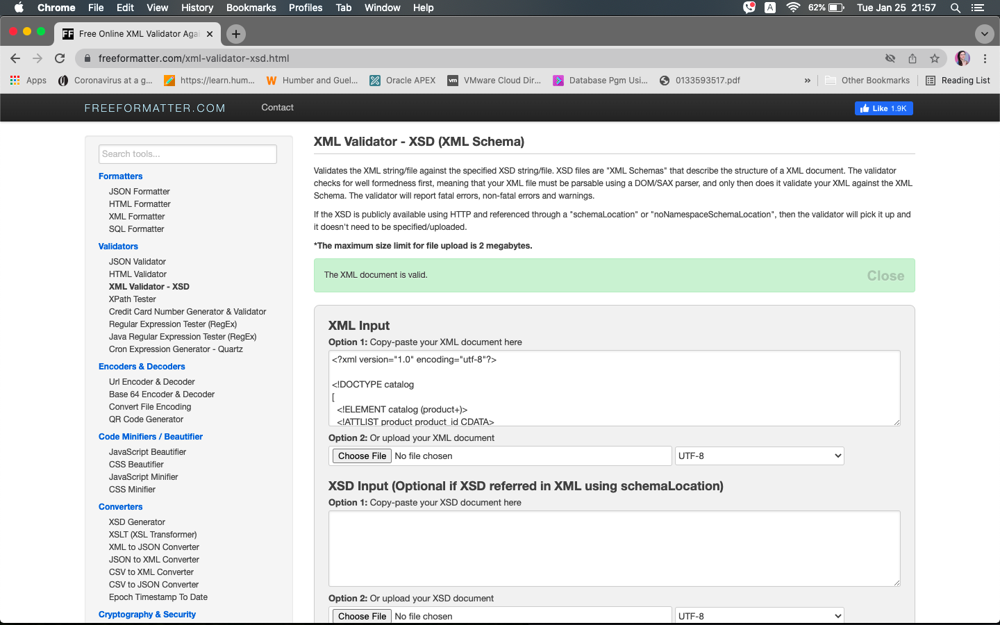
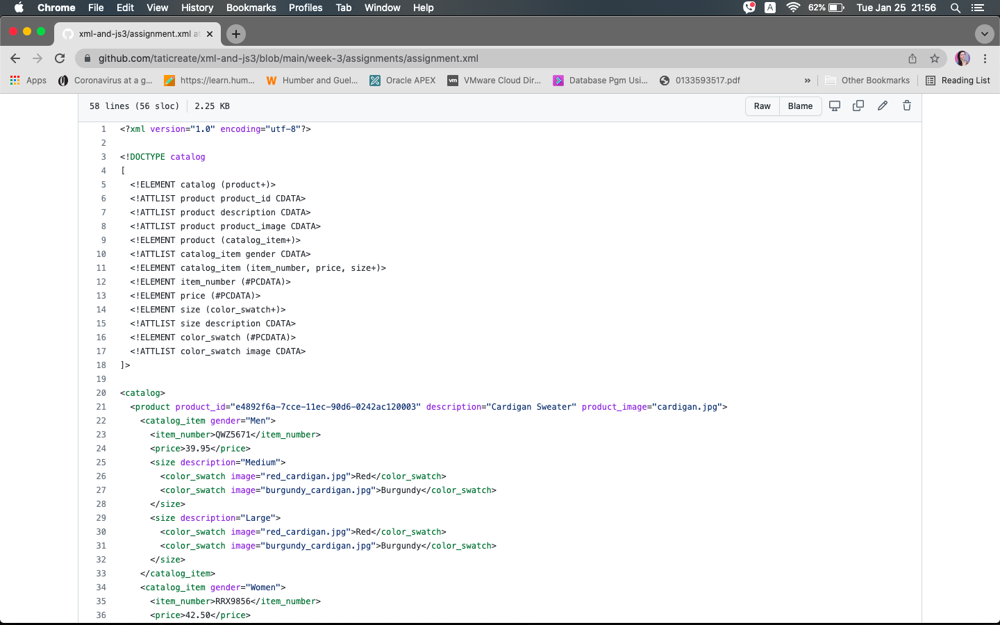
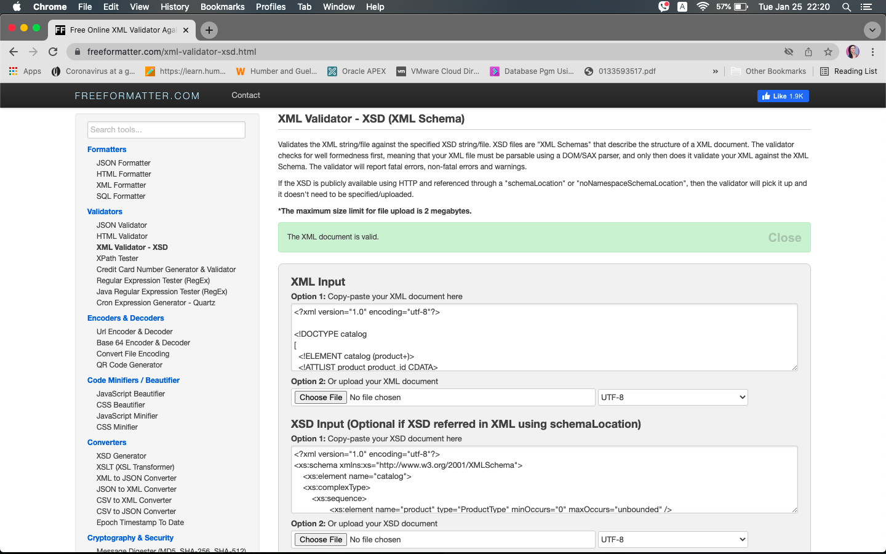
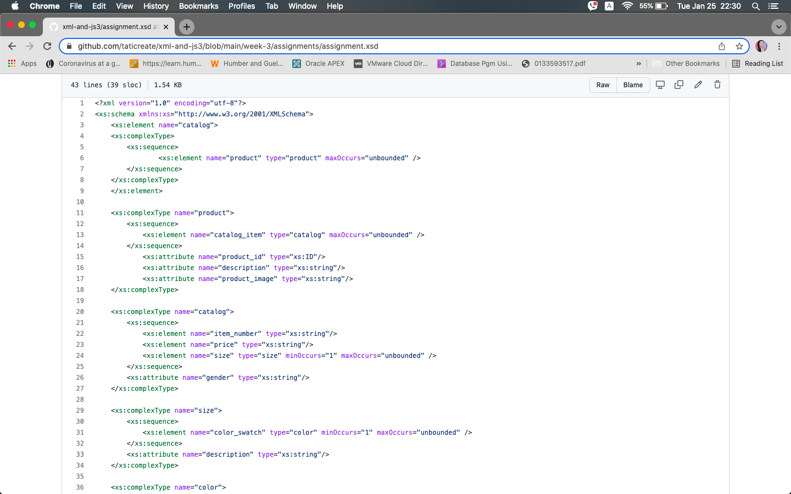

# Assignment

1. Open `week-3/assignments/assignment.xml` in your editor
2. Create DTD for this file and validate it using any of the tools we used

   
4. Create XSD for this file and validate it using any of the tools we used

   
6. Explain your thought process for these 2 declarations
