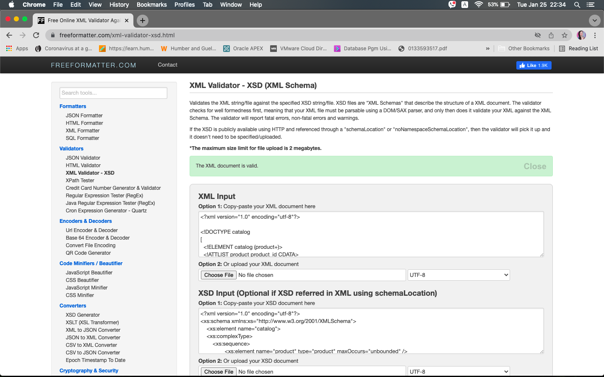

# Assignment

1. Open `week-3/assignments/assignment.xml` in your editor
2. Create DTD for this file and validate it using any of the tools we used

   
4. Create XSD for this file and validate it using any of the tools we used

   
6. Explain your thought process for these 2 declarations
First I created the DTD in the assignment.xml file, by going down through the document and then specifying its elements and attributes at the top of the document. The XSD file needed to be created separately under it's own extension. Creating XSD was more time consuming, due to the nested structure system of its elements, types and sequences. But the final product created with XSD allows for a more clear visual for understanding the file contents. 
